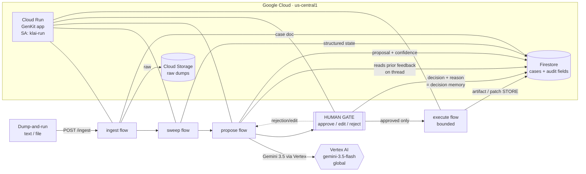

# Architecture — KLAI Agentic

A governed agent loop on Google Cloud. Each stage writes explicit state to Firestore; execution runs only on human-approved items; every decision is logged.

## Components
| Concern | Service | Notes |
|---|---|---|
| Compute / API | **Cloud Run** (`us-central1`) | GenKit express app; runtime SA `klai-run` |
| Agent framework | **GenKit** (`@genkit-ai/google-genai`) | flows: ingest · sweep · propose · gate · execute |
| LLM | **Gemini 3.5 Flash · Vertex AI** | `global` endpoint (3.5 not on regional us-central1) |
| State | **Firestore** (native, `us-central1`) | `cases` collection; audit-field doc = state machine |
| Blobs | **Cloud Storage** | `klai-agentic-dumps-<projectnum>` raw dumps |
| Auth | **ADC / service account** | no API keys in repo |
| Observability | **Cloud Logging** | structured `{case_id, stage, status, error}` |

## Governance invariants
- **The gate is structural.** No stage auto-closes; `execute` refuses any case whose `approval_status != approved`.
- **Decision memory.** Rejections/edits persist to `user_feedback`; `propose` reads prior thread feedback back into context → future proposals honor past judgment.
- **Auditable state.** Every case carries `confidence · requires_human_review · approval_status · approved_by · approved_at · execution_status · execution_artifact_url · reasoning_summary · user_feedback`.
- **Idempotent by case id** — retries update the same doc, never duplicate execution.

## Proven (checkpoint, 2026-08-18)
Live at `https://klai-agentic-760656259079.us-central1.run.app`: `/hello` = Vertex Gemini 3.5 + Firestore write; `/gate` + `/propose` = decision-memory read-back (reject "too generic" → next proposal leads with a concrete next step).
